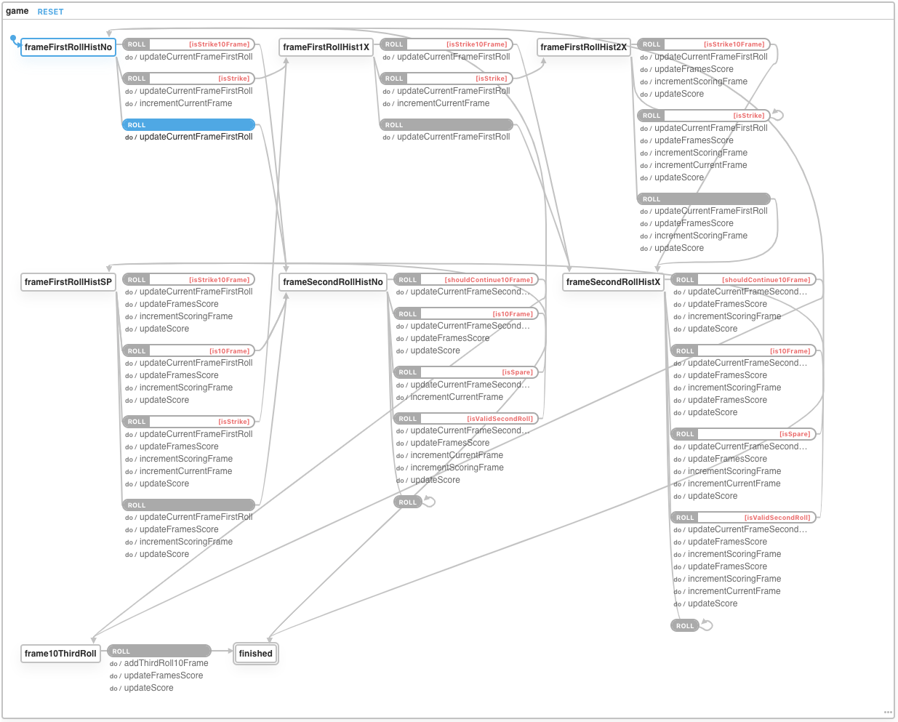

# Bowling score simulation

### Testing with Xstate model based testing

#### A graph model of all possible app states (vertices), their transitions (edges), and shortest paths is generated online using app code.
- [Online Visualizer](https://xstate.js.org/viz/?gist=d0dfe041710c7a91edd8488769a92152)  
- 

#### All paths are tested against test at each vertex.
- 
